# Mô hình triển khai Postgresql High Availability

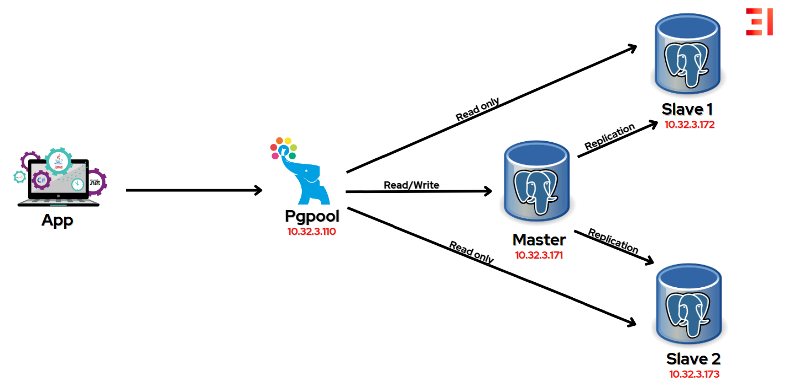

- Mình có 5 servers (Ubuntu 20.04 LTS) và quy định như sau bạn có thể note lại để tiện theo dõi nhé:
    + Server 0: Dùng để chạy ansible
    + Server 1: 192.168.56.11 (Postgresql Master) – Server Master
    + Server 2: 192.168.56.12 (Postgresql Slave 1) – Server Slave 1
    + Server 3: 192.168.56.13 (Postgresql Slave 2) – Server Slave 2
    + Server 4: 192.168.56.10 (Pgpool2 – configure Postgresql high availability) – Server HA

# Phần 1: Thiết lập Master-Slave (Master-Replica)

- Đầu tiên như trên mô hình triển khai và quy ước chúng ta sẽ cài đặt Postgresql trên 3 servers là server 1, 2, 3 tương ứng là 1 Master và 2 Slave

## Step 1: Cài đặt Postgresql

###  Cài đặt và cấu hình ansible

```bash
$ mkdir -p /home/ansible/setup; cd /home/ansible/setup; vim install_ansible.sh
```

```bash
#!/bin/bash

# Install required packages
sudo apt update
sudo apt install -y software-properties-common
sudo apt-add-repository --yes --update ppa:ansible/ansible
sudo apt install -y ansible

# Install Ansible via pip
sudo apt install -y python3-pip
sudo pip3 install ansible
```

```bash
$ chmod +x install_ansible.sh 

$ ./install_ansible.sh

$ ansible --version

$ mkdir -p /home/ansible/project; cd /home/ansible/project

$ vim inventory.ini

$ ssh-copy-id root@10.32.3.131
```

#### Tạo ssh key

```bash
$ ssh-keygen -t rsa # tạo keygen

$ ssh-copy-id root@192.168.56.11

$ ssh-copy-id root@192.168.56.12 

$ ssh-copy-id root@192.168.56.13 

# Chạy ansible để cài đặt postgresql verison 14 trên 3 servers.
$ ansible-playbook -i inventory.ini dbservers-config.yml
```

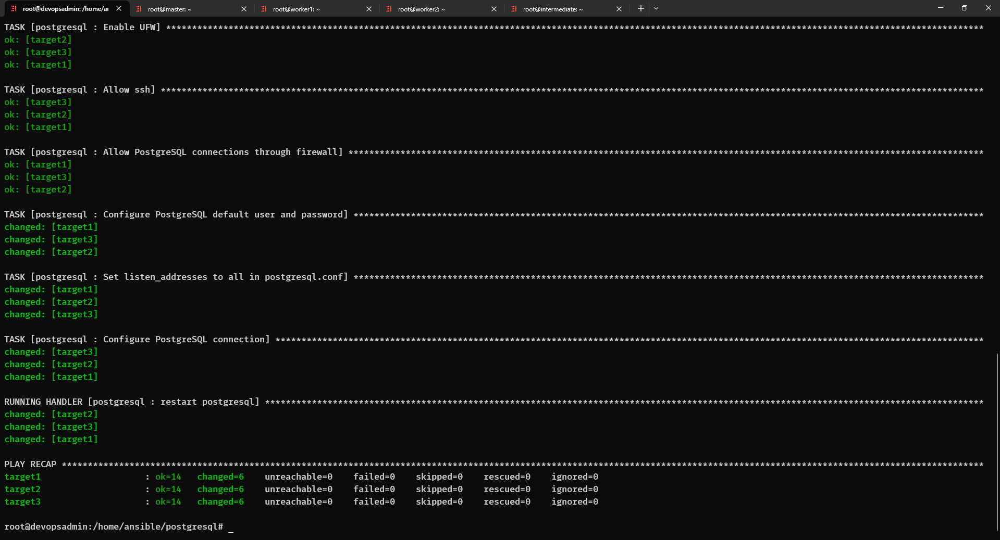

### Cài đặt Postgresql bằng Bash script

- Nếu bạn chưa sử dụng Ansible hoặc không muốn cài đặt bằng Ansible thì bạn có thể cài đặt bán thủ công bằng cách truy cập vào từng server và làm các bước sau để cài đặt Postgresql 14 bằng Bash script:

```bash
$ vi install_postgresql.sh #  tạo file bash script cài đặt Postgresql và copy nội dung sau vào file:
```

```bash
#!/bin/bash

# Update the package list and upgrade installed packages
sudo apt update
sudo apt upgrade -y

# Install PostgreSQL repository key
wget --quiet -O - https://www.postgresql.org/media/keys/ACCC4CF8.asc | sudo apt-key add -

# Add PostgreSQL repository
RELEASE=$(lsb_release -cs)
echo "deb http://apt.postgresql.org/pub/repos/apt/ $RELEASE-pgdg main" | sudo tee /etc/apt/sources.list.d/pgdg.list

# Update the package list again
sudo apt update

# Install PostgreSQL 14
sudo apt install -y postgresql-14

# Optional: Install additional PostgreSQL contrib packages
sudo apt install -y postgresql-contrib-14

# Start and enable PostgreSQL service
sudo systemctl start postgresql
sudo systemctl enable postgresql

echo "PostgreSQL 14 has been installed successfully."
```

```bash
$ chmod +x install_postgresql.sh && ./install_postgresql.sh # cấp quyền thực thi và chạy file bash script cài đặt Postgresql

$ vi /etc/postgresql/14/main/postgresql.conf # truy cập file cấu hình Postgresql và tìm dòng dưới đây và sửa để có thể kết nối từ các server khác
```

```conf
listen_addresses = '*' # PostgreSQL sẽ lắng nghe kết nối từ tất cả các địa chỉ IP trên máy chủ
```

```bash
$ systemctl restart postgresql # khởi động lại Postgresql để áp dụng cấu hình

$ vi /etc/postgresql/14/main/pg_hba.conf # truy cập file chứa các quy tắc xác thực, phân quyền rồi xóa đi và điền như sau lưu và đóng lại
```

```conf
# TYPE  DATABASE        USER            ADDRESS                 METHOD
local   all             all                                     peer
# IPv4 local connections:
host    all             all             0.0.0.0/0               scram-sha-256
# IPv6 local connections:
host    all             all             ::1/128                 scram-sha-256
# Allow replication connections from localhost, by a user with the
# replication privilege.
local   replication     all                                     peer
host    replication     all             127.0.0.1/32            scram-sha-256
host    replication     all             ::1/128                 scram-sha-256
```

```bash
$ ufw enable # mở firewall

$ ufw allow 5432/tcp # mở port 5432 để có thể truy cập từ bên ngoài
```

### Kiểm tra trạng thái các Postgesql đã cài đặt

```bash
$ systemctl status postgresql # kiểm tra trạng thái của server Master cài đặt Postgresql
```
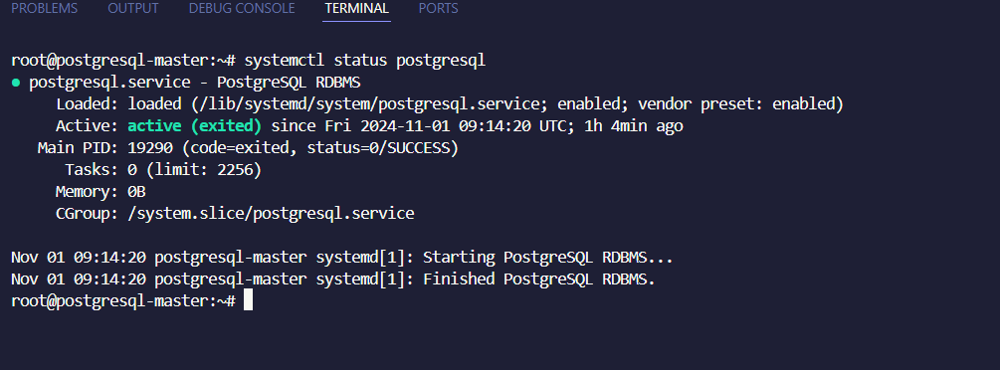
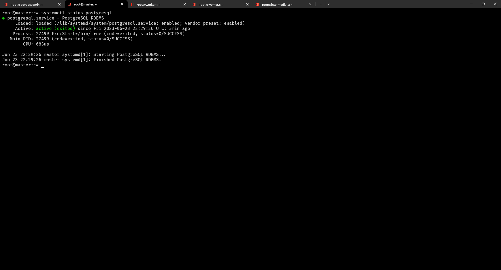

```bash
$ systemctl status postgresql #tiếp tục sang kiểm tra trạng thái của server Slave 1 cài đặt Postgresql
```

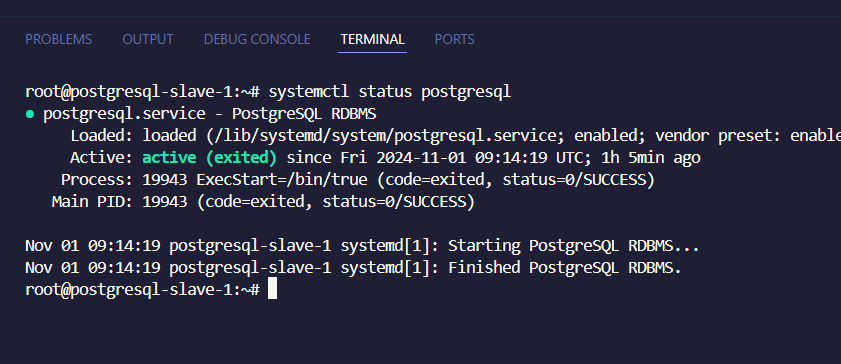

```bash
$ systemctl status postgresql # tiếp tục sang kiểm tra trạng thái của server Slave 2 cài đặt Postgresql
```

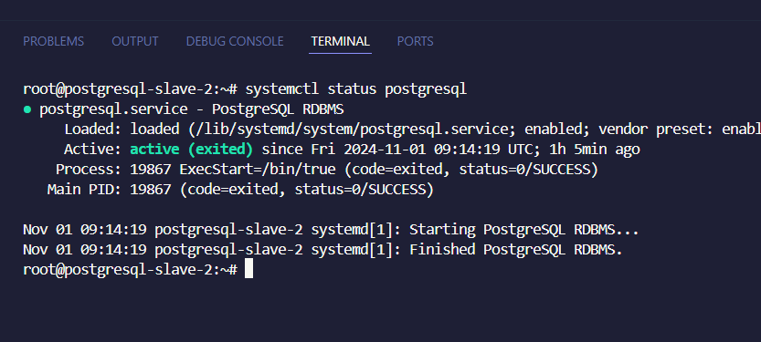

## Step 2: Thiết lập cấu hình trên Master

- Tiếp theo chúng ta cần tạo một user replica để phục vụ cho việc thiết lập Postgresql high availability Master-Slave

- Tại server `Master` tiến hành thực hiện các bước sau để cấu hình cho Postgresql thành node master

```bash
$ sudo su - postgres # chuyển đổi người dùng hiện tại sang người dùng “postgres”

$ createuser --replication -P -e replicator #  tạo một người dùng “replicator” trong cơ sở dữ liệu PostgreSQL, tiến hành nhập Password bạn muốn để hoàn thành
```
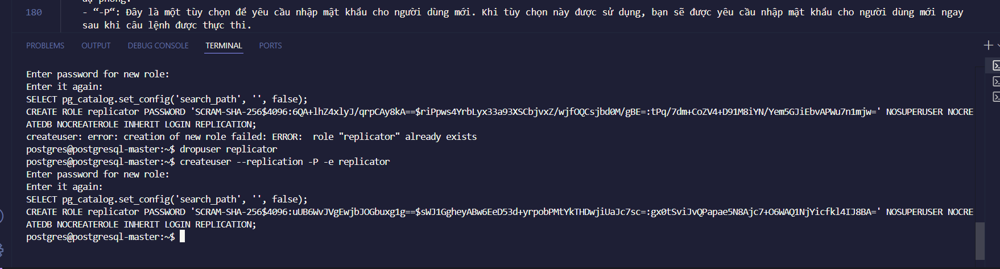
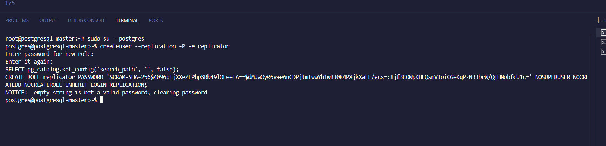

- Giải thích từng phần của câu lệnh:
    - “createuser“: Đây là một câu lệnh trong PostgreSQL được sử dụng để tạo một người dùng mới trong cơ sở dữ liệu.
    - “–replication“: Đây là một tùy chọn của câu lệnh createuser để chỉ định rằng người dùng mới được tạo sẽ có quyền sao chép (replication). Quyền sao chép cho phép người dùng tham gia vào việc sao chép dữ liệu từ máy chủ PostgreSQL chính (primary) sang các máy chủ PostgreSQL khác (standby) để đảm bảo tính sẵn sàng và sao lưu dự phòng.
    - “-P“: Đây là một tùy chọn để yêu cầu nhập mật khẩu cho người dùng mới. Khi tùy chọn này được sử dụng, bạn sẽ được yêu cầu nhập mật khẩu cho người dùng mới ngay sau khi câu lệnh được thực thi.
    - “-e“: Đây là một tùy chọn để hiển thị câu lệnh SQL được sử dụng để tạo người dùng trong kết quả đầu ra. Nó giúp bạn xem câu lệnh SQL tạo người dùng đó.
    - “replicator“: Đây là tên người dùng mới được tạo. Trong ví dụ này, người dùng mới được đặt tên là “replicator”.

- Khi câu lệnh được thực thi thành công, một người dùng mới có tên “replicator” sẽ được tạo trong cơ sở dữ liệu PostgreSQL với quyền sao chép (replication) và bạn sẽ được yêu cầu nhập mật khẩu cho người dùng này.

```bash
$ exit # thoát khỏi người dùng “postgres”
$ vi /etc/postgresql/14/main/pg_hba.conf # mở file chứa các quy tắc xác thực và phân quyền cho các kết nối đến cơ sở dữ liệu PostgreSQL và thêm 2 dòng dưới đây vào cuối file (2 IP server Slave 1 và Slave 2)
```

```conf
host    replication     replicator      192.168.56.12/24       md5
host    replication     replicator      192.168.56.13/24       md5
```

```bash
$ systemctl restart postgresql # khởi động lại Postgresql
```

- Và đây là những câu lệnh đã chạy ở trên để thiết lập Postgresql trên Server Master (192.168.56.11)

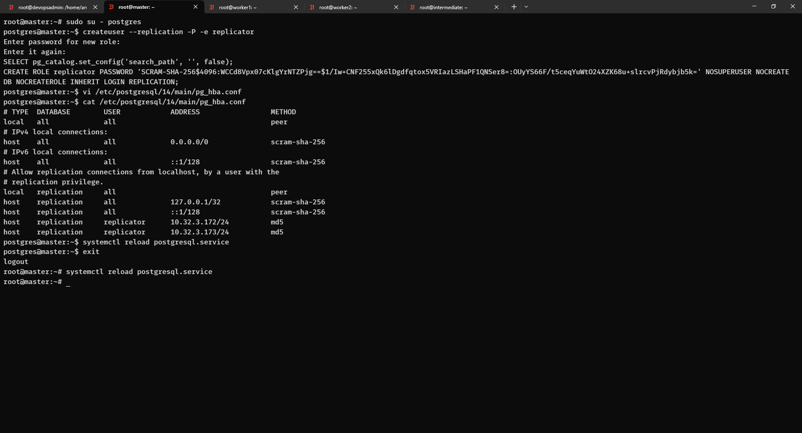

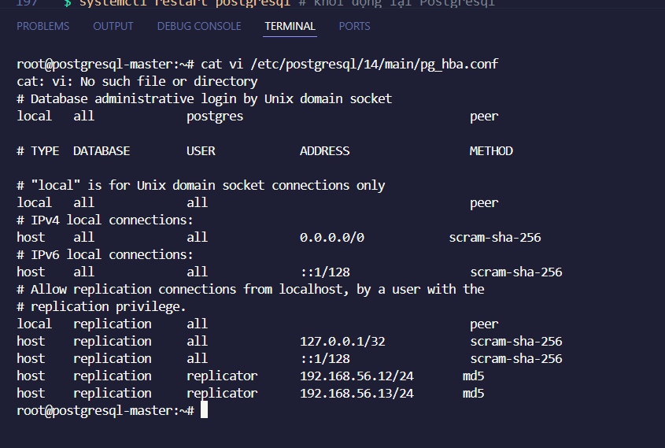


## Step 3: Thiết lập cấu hình trên Slave

- Truy cập sang server `Slave 1` và làm các bước sau:

```bash
$ systemctl stop postgresql # dừng Postgresql

$ cp -R /var/lib/postgresql/14/main /var/lib/postgresql/14/stand-by-bkp backup # lại data cũ ra một thư mục khác (bước này có thể bỏ qua)

$ rm -rf /var/lib/postgresql/14/main/* # xóa dữ liệu cũ

$ sudo su - postgres # chuyển đổi người dùng hiện tại sang người dùng “postgres”

$ pg_basebackup -h 192.168.56.11 -D /var/lib/postgresql/14/main -U replicator -P -v -R -X stream -C -S slave_1 # sử dụng để sao chép cơ sở dữ liệu PostgreSQL từ một máy chủ chính (primary) sang một máy chủ sao chép (standby) mới và bạn tiến hành nhập mật khẩu user replicator vừa tạo trên Postgresql server Master
```

- Giải thích từng phần của câu lệnh:

    - “pg_basebackup“: Đây là một công cụ dòng lệnh được cung cấp bởi PostgreSQL để sao chép cơ sở dữ liệu từ máy chủ chính sang máy chủ sao chép.
    - “-h 192.168.56.11“: Đây là tùy chọn để chỉ định địa chỉ IP hoặc tên máy chủ của máy chủ chính từ nơi cơ sở dữ liệu sẽ được sao chép.
    - “-D /var/lib/postgresql/14/main“: Đây là tùy chọn để chỉ định đường dẫn đến thư mục dữ liệu của máy chủ sao chép, nơi cơ sở dữ liệu sao chép sẽ được lưu trữ.
    - “-U replicator“: Đây là tùy chọn để chỉ định tên người dùng (replicator) mà công cụ pg_basebackup sẽ sử dụng để kết nối và sao chép cơ sở dữ liệu từ máy chủ chính.
    - “-P“: Đây là tùy chọn để yêu cầu nhập mật khẩu cho người dùng (replicator) khi thực hiện sao chép.
    - “-v“: Đây là tùy chọn để hiển thị tiến trình sao chép chi tiết trong quá trình thực thi lệnh.
    - “-R“: Đây là tùy chọn để chỉ định rằng máy chủ sao chép sẽ được cấu hình để chạy dưới dạng máy chủ sao chép (standby) và sẵn sàng để nhận các bản cập nhật từ máy chủ chính.
    - “-X stream“: Đây là tùy chọn để chỉ định phương thức truyền dữ liệu là stream replication. Trong trường hợp này, dữ liệu sẽ được truyền từ máy chủ chính đến máy chủ sao chép thông qua luồng dữ liệu (stream).
    - “-C“: Đây là tùy chọn để chỉ định rằng tệp pg_control cũng sẽ được sao chép. Tệp pg_control chứa thông tin quản lý cấu hình và trạng thái của cơ sở dữ liệu.
    - “-S slave_1“: Đây là tùy chọn để chỉ định tên người ghi (slot) được sử dụng để xác định vị trí sao chép. Tên người ghi được sử dụng để giới hạn việc sao chép chỉ đến vị trí xác định, giúp giữ cơ sở dữ liệu sao chép ở một trạng thái nhất định.

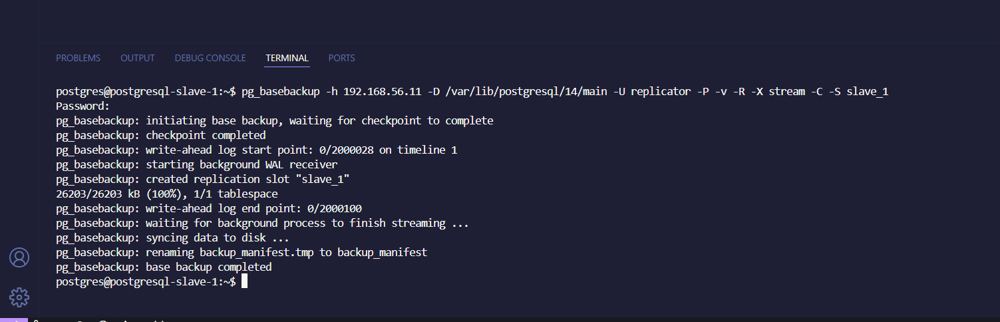

```bash
$ exit # thoát khỏi người dùng “postgres”

$ systemctl start postgresql # khởi động lại Postgresql
```

- Và đây là những câu lệnh đã chạy ở trên để thiết lập trên Server Slave 1 (192.168.56.12)

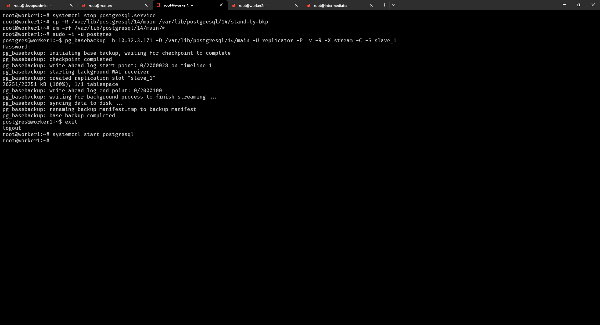

Làm tượng tự như ta cũng được kết quả tương tự (chú ý bước sao chép dữ liệu bạn hãy đổi thành slave_2) trên server Slave 2 (192.168.56.13)

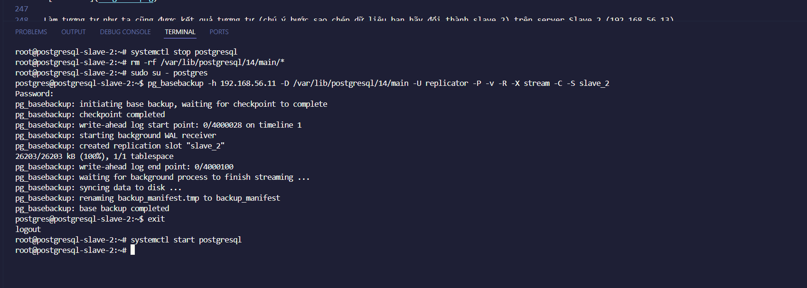

- Tất nhiên là chúng ta cũng có thể sử dụng Ansible và Bash script để thiết lập các bước trên tự động vì nhiều Server thì các bước trên sẽ tốn thời gian, nhưng phạm vi hướng dẫn mình sẽ làm từng bước còn khi bạn hiểu rồi thì có thể làm theo ý của mình sao cho tối ưu nhất.

## Step 4: Kiểm tra hoạt động Master-Slave

- Chúng ta quay lại Server `master` và kiểm tra bằng các bước sau

```bash
$ sudo -i -u postgres psql postgres -c "SELECT * FROM pg_replication_slots;" # truy vấn thông tin về các người ghi (replication slots) đang tồn tại trong Postgresql
```

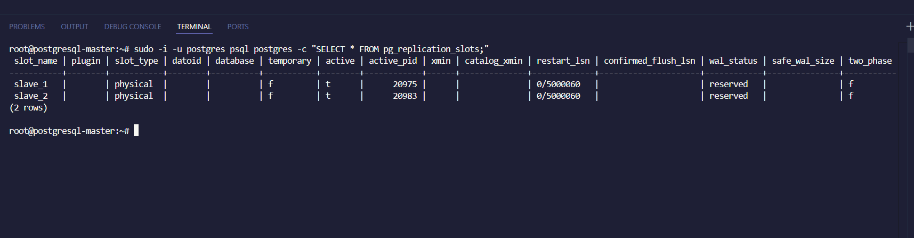

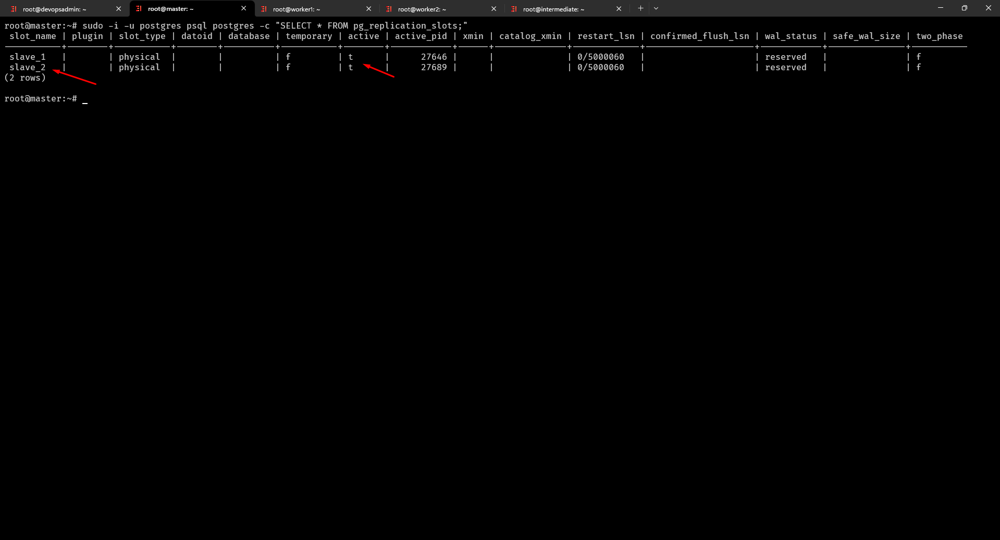

- Chúng ta đã thiết lập và có 2 Slave trạng thái là t (true) và một số thông tin khác bạn hãy tìm hiểu thêm nếu muốn nhé chúng ta tiếp tục kiểm tra

```bash
$ sudo -i -u postgres psql postgres #truy cập vào môi trường dòng lệnh của PostgreSQL với quyền người dùng “postgres” thông qua sudo
```

- Tạo table users

```sql
postgres=# CREATE TABLE users (
    id SERIAL PRIMARY KEY,
    name VARCHAR(100)
);
```

- Thêm dữ liệu sample vào table users

```sql
postgres=# INSERT INTO users (name) VALUES ('administrator'); INSERT INTO users (name) VALUES ('viettu');

postgres=# select * from users; --truy vấn thông tin
```


- Tiếp theo chúng ta thử qua server `Slave 1` để kiểm tra xem đã được đồng bộ dữ liệu chưa

```bash
$ sudo -i -u postgres psql postgres # truy cập vào môi trường dòng lệnh của PostgreSQL với quyền người dùng “postgres” thông qua sudo

postgres=# select * from users; # truy vấn thông tin và đã có kết quả tương tự Slave 1 của chúng ta đã hoạt động
```

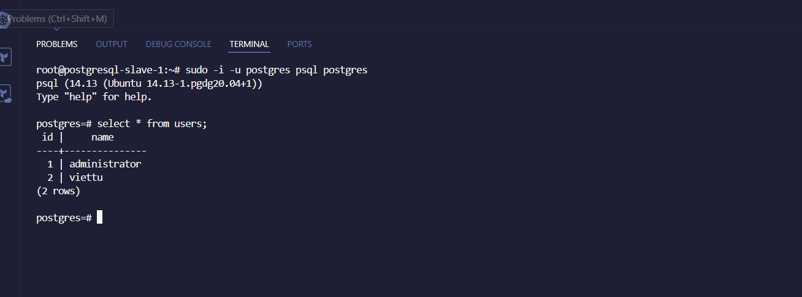

- Tương tự chúng ta check qua server Slave 2 và thấy rằng nó cũng đã hoạt động

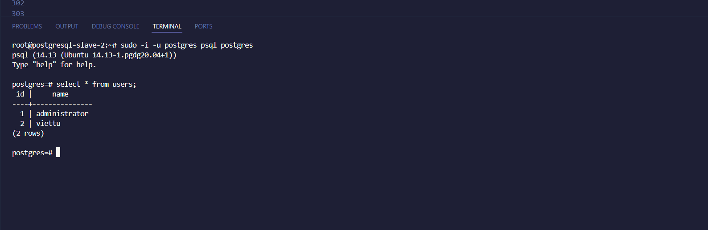

- Bạn có thấy mô hình ở trên Slave chỉ có thể read only không là chỉ có thể select dữ liệu và không thể insert chúng ta cùng thử trên server `Slave 2`

```sql
postgres=# INSERT INTO users (name) VALUES ('guest'); --thêm dữ liệu và được kết quả lỗi dưới đây
```

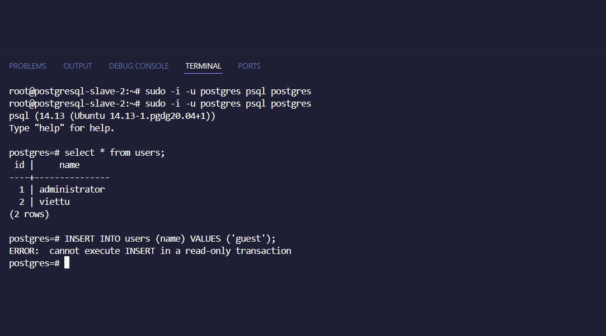

- Vậy là chúng ta đã thiết lập thành công bước đầu Postgresql high availability cho 3 servers với Server 1 làm Postgresql Master và Server 2 làm Postgresql Slave 1 và Server 3 làm Postgresql Slave 2.

## Step 5: Cấu hình fail over (quan trọng phải biết)

- Tiếp theo, như đã nói ngay lúc đầu vấn đề của chúng ta là nếu như Master gặp vấn đề gì đó và bị shutdown thì sao? lúc đó ta sẽ phải cấu hình để cho Slave lên làm Master để có thể đảm bảo việc ghi và đọc bạn nhớ chứ Slave mặc định chỉ có thể đọc dữ liệu.

- Trên server Master tiến hành stop Postgres và trên `server Slave 1 và server Slave 2` bạn cấu hình như dưới đây:

```sql
postgres=# SELECT pg_promote(); -- chuyển Slave thành Master
```

- Lúc này Slave 1 và Slave 2 sẽ như là Master có khả năng ghi và đọc như bình thường

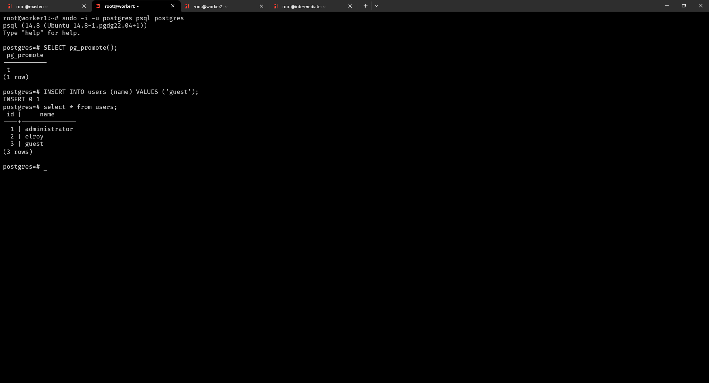

- Tiếp theo bạn cấu hình lại ví dụ:
    - Server 2 => Master
    - Server 3 => Slave của server 2
    - Và khi Server 1 (Master bị tắt) được bật lại, Server 1 => Slave của Server 2

- Lúc này chúng ta sẽ sử dụng Server 2 để tiếp tục thực hiện những truy vấn và Server 3 là Slave cho server 2.

- Bạn có thể xóa một cấu hình Slave trên Server 1 bằng cách chạy lệnh sau (ví dụ xóa slave_2 – xóa Server 3 không còn là Slave của Server 1)

```sql
postgres=# SELECT pg_drop_replication_slot('slave_2');
```

- Bạn thấy không thật là mất công sức và phức tạp khi làm thủ công phải không nào, tuy nhiên bạn không cần phải lo lắng vì đó là phần lý thuyết mà bạn cần phải nắm được còn sau đây mình sẽ hướng dẫn những cách từ bản chất đến công cụ để cấu hình Postgresql high availability.

### Bash script thiết lập auto Postgresql high availability

- Tại server HA (Server 4) tiến hành các bước sau (bạn hãy chú ý thay đổi những thông tin về IP server và Password của bạn nhé)

- Chúng ta cần thiết lập để cho Server thiết lập Postgresql high availability có thể ssh đến các server Postgresql để có thể thực hiện chạy Bash script

```bash
$ ssh-keygen -t rsa # tạo key (bạn cứ enter nhé)

$ ssh-copy-id root@192.168.56.11 # copy key sang server Master (nhập password)

$ ssh-copy-id root@192.168.56.12 #copy key sang server Slave 1 (nhập password)

$ ssh-copy-id root@192.168.56.13 #copy key sang server Slave 2 (nhập password)

$ cd /home #chuyển đến home

$ vi slave-to-master.sh # tạo file thiết lập Slave thành Master với nội dung sau
```

```bash
#!/bin/bash

# truy cập vào môi trường postgresql thiết lập có thể write/read
sudo -i -u postgres psql postgres -c "SELECT pg_promote();"

# cập nhật user replicator
sudo -i -u postgres psql postgres -c "ALTER USER replicator WITH PASSWORD 'viettu';"

# ghi thông tin server còn lại vào để làm thành slave của server này
echo "host    replication     replicator      192.168.56.13/24          md5" >> /etc/postgresql/14/main/pg_hba.conf

# khởi động lại postgresql
systemctl restart postgresql
```

```bash
$ vi new-slave-master.sh # tạo file thiết lập kết nối Slave đến Master mới với nội dung
```

```bash
#!/bin/bash

# truy cập vào môi trường postgresql thiết lập có thể write/read
sudo -i -u postgres psql postgres -c "SELECT pg_promote();"

# dừng postgresql
systemctl stop postgresql

# xóa hết dữ liệu cũ
rm -rf /var/lib/postgresql/14/main/*

# chạy lệnh backup dữ liệu từ master mới
sudo -u postgres PGPASSWORD="viettu" pg_basebackup -h 192.168.56.12 -D /var/lib/postgresql/14/main -U replicator -P -v -R -X stream -C -S slave_1

# khởi động lại postgresql
systemctl start postgresql
```

```bash
$ vi check-postgresql.sh # tạo file health check Server Master nếu Server Master thất bại sẽ tiến hành chạy để tạo Master Slave mới
```

```bash
#!/bin/bash

log_file="output.log"
max_size=10485760  # Giới hạn kích thước là 10MB (10 * 1024 * 1024 bytes)

server1_ip="192.168.56.11"
server2_ip="192.168.56.12"
server3_ip="192.168.56.13"
port="5432"
username="postgres"
password="viettu"
database="postgres"

# Biến flag để kiểm tra trạng thái đã tạo file hay chưa
created_file=0


while true; do
    # Kiểm tra kết nối tới server 1
    pg_isready -h $server1_ip -p $port -U $username -d $database > /dev/null 2>&1

    if [ $? -ne 0 ]; then
        if [ $created_file -eq 0 ]; then
            # Nếu server 1 không phản hồi và file chưa được tạo
            scp /home/slave-to-master.sh root@$server2_ip:slave-to-master.sh
            scp /home/new-slave-master.sh root@$server3_ip:new-slave-master.sh
            ssh root@$server2_ip "chmod +x slave-to-master.sh && ./slave-to-master.sh"
            ssh root@$server3_ip "chmod +x new-slave-master.sh && ./new-slave-master.sh"
            current_time=$(date +"%Y-%m-%d %H:%M:%S")
            echo "$current_time - Postgresql Master không hoạt động đã tiến hành chuyển đổi Master"
            created_file=1  # Đánh dấu là file đã được tạo
        fi
    else
        current_time=$(date +"%Y-%m-%d %H:%M:%S")
        echo "$current_time - Server 1 đang hoạt động"
        created_file=0  # Đặt trạng thái file về chưa tạo khi kết nối được khôi phục
    fi

    # Kiểm tra kích thước của tệp tin log
    if [ -f $log_file ] && [ $(stat -c %s $log_file) -gt $max_size ]; then
        truncate -s 0 $log_file  # Cắt giảm kích thước tệp tin log về 0
        echo "Giảm kích thước file."
    fi

    sleep 5
done
```

- File trên mình đã giải thích khá kỹ rồi nhưng mình sẽ giải thích thêm một chút:

    - File sẽ tiến hành kiểm tra trạng thái Postgresql trên server Master, nếu như hoạt động bình thường sẽ ghi vào file output.log Server 1 đang hoạt động và nếu server Master có vấn đề sẽ tiến hành Copy 2 file Bash script trên vào server 2 và server 3 tương ứng cấu hình server 2 thành Master mới và server 3 thành Slave của server 2, khi đó bạn có thể kiểm tra xem server 1 có vấn đề khiến nó không hoạt động.
    - File log sẽ tối đa là 10MB

```bash
$ ./check-postgresql.sh >> output.log & # chạy file Bash script dưới nền

$ tail -f output.log # tiến hành kiểm tra file log

$ systemctl stop postgresql # sử dụng lệnh này ở server 1 (giả định server 1 bị down)
```

- Bạn làm đúng các bước trên và sẽ được kết quả sau

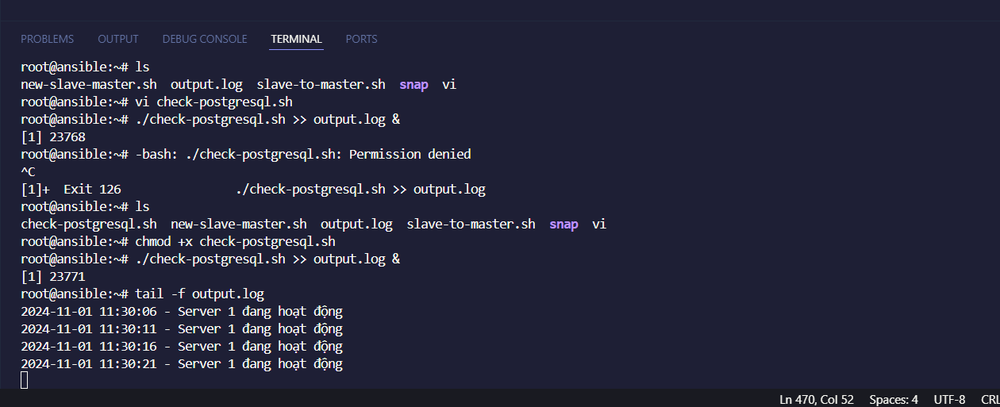

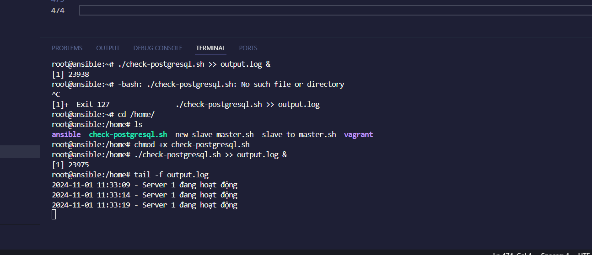


- Vậy là mình và bạn cùng thiết lập xong các bước để chuyển đổi Master-Slave, bạn có thể cải tiến cấu hình trên bằng cách lưu lại những thông tin Password vào file để tăng khả năng bảo mật.

## Step 6: Cấu hình tự động backup dữ liệu

- Tiếp tục chúng sẽ tiến hành thiết lập cấu hình tự động backup dữ liệu

- Ví dụ bạn có database postgres trên 3 servers như đã thiết lập, 1 Master và 2 Slave, bạn muốn backup lại database đó định kỳ và tự động hãy làm theo các bước dưới đây:

- Chúng ta chọn server Slave 2 để thiết lập tự động backup

```bash
$ vi /home/auto-backup-postgresql.sh #tạo file bash scipt với nội dung dưới đây (mình đã mô tả kỹ bạn hãy xem nhé)
```

```bash
#!/bin/bash

# Đường dẫn đến thư mục lưu trữ các bản sao lưu
backup_dir="/đường/dẫn/thư/mục/sao/lưu"

# Đường dẫn tới công cụ pg_dump
pg_dump_path="/đường/dẫn/tới/pg_dump"

# Tên cơ sở dữ liệu cần sao lưu
database_name="tên_cơ_sở_dữ_liệu"

# Tạo tên tệp tin sao lưu với định dạng ngày-tháng-năm-giờ-phút-giây
backup_file="$backup_dir/backup_$(date +"%Y-%m-%d-%H-%M-%S").sql"

# Thực hiện sao lưu cơ sở dữ liệu
sudo -i -u postgres pg_dump -U postgres -d $database_name -f $pg_dump_path/$backup_file

# Đếm số lượng các bản sao lưu hiện có
backup_count=$(ls -1 $backup_dir | wc -l)

# Nếu số lượng bản sao lưu vượt quá 7, xóa bản sao lưu cũ nhất
if [ $backup_count -gt 7 ]; then
  oldest_backup=$(ls -t $backup_dir | tail -1)
  rm "$backup_dir/$oldest_backup"
fi
```

```bash
$ chmod +x /home/auto-backup-postgresql.sh # cấp quyền thực thi cho file

$ crontab -e # mở crontab (đây là một tool lập lịch chúng ta sử dụng để cài đặt chạy file auto backup)

$ 0 1 * * * /home/auto-backup-postgresql.sh # thiết lập 1h sáng hàng ngày sẽ chạy file backup
```

# Phần 2: Thiết lập Postgresql high availability với Pgpool

- Như ở trên bạn thấy các servers cài đặt Postgresql vẫn là những kết nối độc lập vậy để cấu hình cho Postgresql high availability thì chúng ta phải thực hiện bước kết nối 3 servers Postgresql trên thành 1 connection duy nhất.

- Và cấu hình việc này cũng sẽ giúp chúng ta chia tải đến truy vấn giữa các database, ví dụ server Master bạn để tài nguyên nhiều hơn thì cho kết nối đến nó nhiều hơn, chúng ta có rất nhiều cách khác nhau để làm việc này như HAproxy, Nginx,…

-Tuy nhiên trong bài này mình thiết lập Postgresql high availability bằng Pgpool một công cụ mạnh mẽ và giúp bạn có thể tự động hóa được rất nhiều thứ một số ưu điểm như là:
    + Native replication (master-slave, master-master)
    + Connection pooling
    + Load balancing
    + High availability i.e. automatic failover etc
    + In memory query caching

## Thiết lập nhanh chóng

- Đầu tiên chúng ta cùng thực hiện cách đơn giản trước đó chính là sử dụng docker-compose để thiết lập Pgpool Postgresql high availability. Hãy đảm bảo bạn đã cài đặt docker trên server 4 (server HA) nhé nếu chưa bạn có thể cài nhanh docker bằng Bash script tham khảo file cài đặt Jenkins CI/CD Pipeline (docker-setup.sh file)

- Trên server HA bạn làm các bước sau:

```bash
$ vi docker-compose.yml #tạo file docker-compose.yml và thông tin dưới đây
```

```yml
version: "2"
services:
  pgpool:
    image: bitnami/pgpool:4
    ports:
      - 5432:5432
    environment:
      - PGPOOL_BACKEND_NODES=0:192.168.56.11:5432,1:192.168.56.12:5432,2:192.168.56.13:5432
      - PGPOOL_SR_CHECK_USER=nobody
      - PGPOOL_SR_CHECK_PASSWORD=viettu
      - PGPOOL_ENABLE_LDAP=no
      - PGPOOL_POSTGRES_USERNAME=postgres
      - PGPOOL_POSTGRES_PASSWORD=postgres
      - PGPOOL_ADMIN_USERNAME=postgres
      - PGPOOL_ADMIN_PASSWORD=postgres
    healthcheck:
      test: ["CMD", "/opt/bitnami/scripts/pgpool/healthcheck.sh"]
      interval: 10s
      timeout: 5s
      retries: 5
```

- Giải thích từng phần của câu lệnh:

+ version: '2': Đây là phiên bản của tệp cấu hình docker-compose. Trong trường hợp này, sử dụng phiên bản 2.
+ services: Đây là phần định nghĩa các dịch vụ được triển khai trong docker-compose.
+ pgpool: Đây là tên dịch vụ, bạn có thể đặt tên tùy ý.
+ image: bitnami/pgpool:4: Đây là hình ảnh Docker sẽ được sử dụng để triển khai dịch vụ pgpool. Trong trường hợp này, sử dụng hình ảnh bitnami/pgpool phiên bản 4.
+ ports: - 5432:5432: Đây là phần mở cổng, cho phép cổng 5432 trên máy chủ Docker host (máy chủ vật lý) được ánh xạ vào cổng 5432 trong container pgpool. Điều này cho phép truy cập vào pgpool qua cổng 5432.
+ environment: Đây là phần định nghĩa các biến môi trường cần thiết cho dịch vụ pgpool. Trong trường hợp này, các biến môi trường bao gồm:
    + PGPOOL_BACKEND_NODES: Chỉ định danh sách các node máy chủ PostgreSQL mà pgpool sẽ cân bằng tải và chuyển hướng các truy vấn đến. Trong trường hợp này, có 3 node với các địa chỉ IP và cổng tương ứng là 10.32.3.171:5432, 10.32.3.172:5432, và 10.32.3.173:5432.
    + PGPOOL_SR_CHECK_USER: Chỉ định người dùng được sử dụng để kiểm tra kết nối đến các node máy chủ PostgreSQL.
    + PGPOOL_SR_CHECK_PASSWORD: Mật khẩu cho người dùng kiểm tra kết nối đến các node máy chủ PostgreSQL.
    + PGPOOL_ENABLE_LDAP: Xác định xem phương thức xác thực LDAP được kích hoạt hay không. Trong trường hợp này, nó được đặt thành “no” để tắt LDAP.
    + PGPOOL_POSTGRES_USERNAME: Tên người dùng PostgreSQL được sử dụng để kết nối đến pgpool.
    + PGPOOL_POSTGRES_PASSWORD: Mật khẩu người dùng PostgreSQL để kết nối đến pgpool.
    + PGPOOL_ADMIN_USERNAME: Tên người dùng quản trị viên của pgpool.
    + PGPOOL_ADMIN_PASSWORD: Mật khẩu người dùng quản trị viên của pgpool.

```bash
$ docker-compose up -d # chạy docker-compose và được kết quả như dưới đây:
```

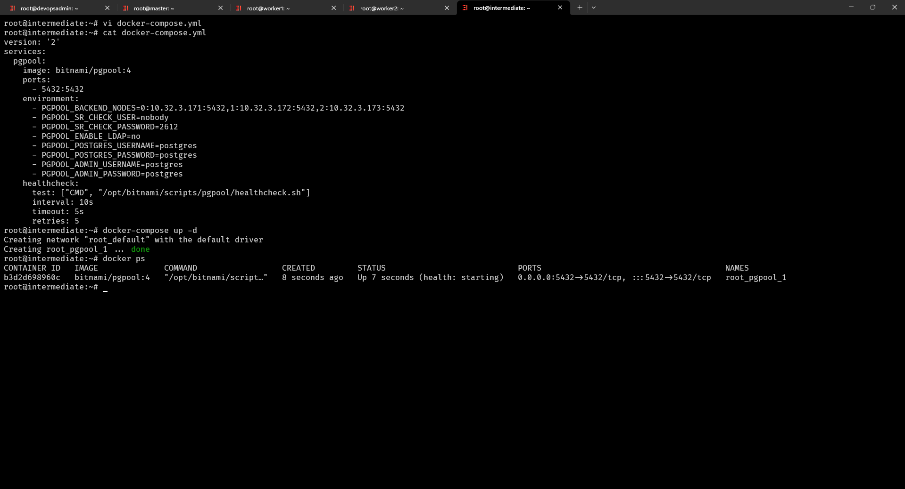


```bash
$ psql -h 192.168.56.10 -p 5432 -U postgres -d postgres # kết nối đến server HA để xem thiết lập đã hoạt động chưa vào được postgres là thành công
```

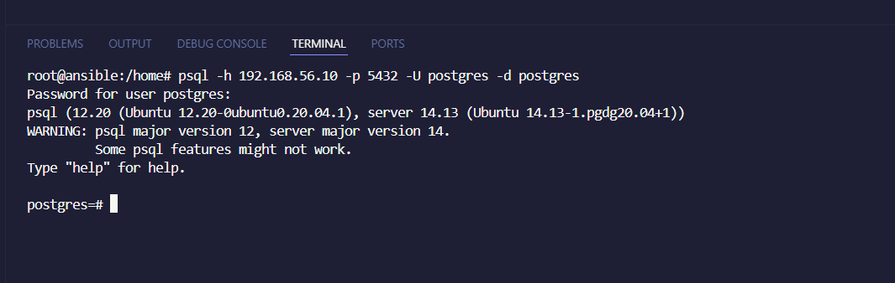

```sql
postgres=# show pool_nodes; -- hiển thị thông tin về các nút (nodes) trong pgpool đã thành công kết nối đến 3 servers Postgresql (Ctrl +Z nếu không thoát được nhé)
```

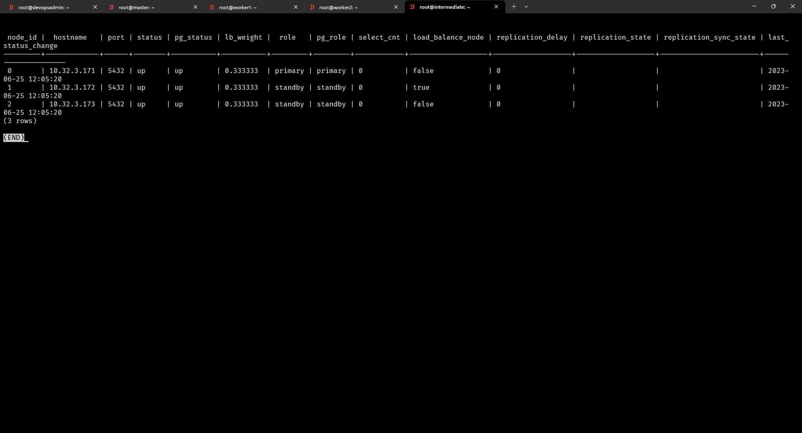

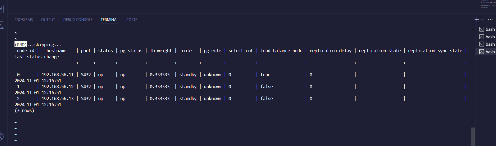

- Tiếp theo để test hoạt động chúng ta cùng thực hiện thật nhiều những câu select như dưới đây (vẫn đang trong kết nối Postgresql server HA):

```sql
postgres=# select * from users; -- tiến hành truy vấn (bạn làm vài lần nhé)

postgres=# show pool_nodes; -- hiển thị lại thông tin các node đã thấy truy vấn được chia sang các database servers
```

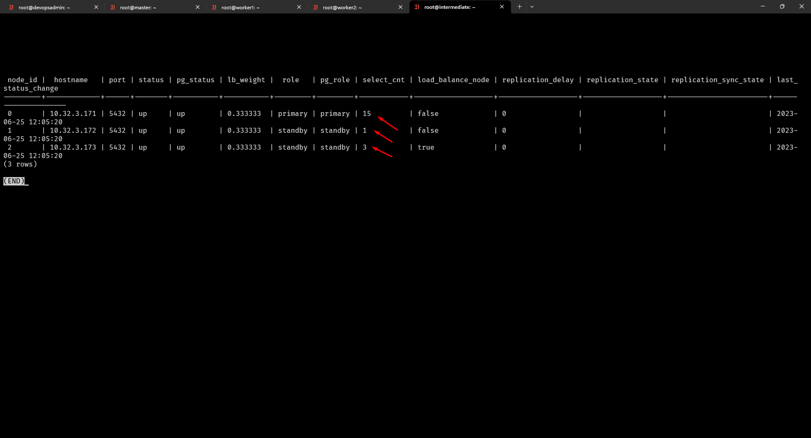

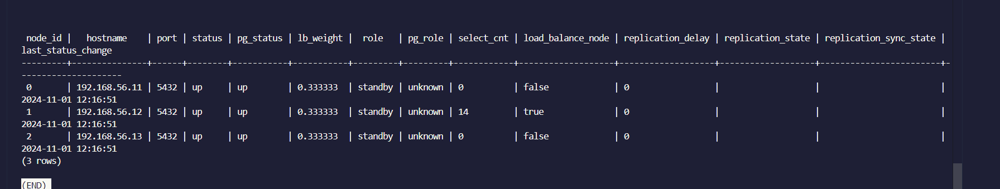

- Bạn có thể cấu hình thêm những Bash script để tự động chuyển đổi slave-master như trên.

# End